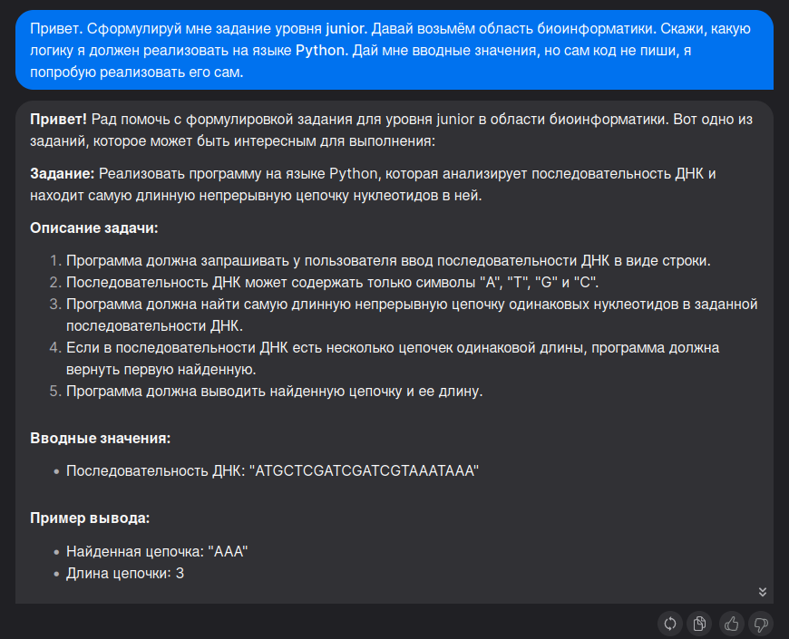
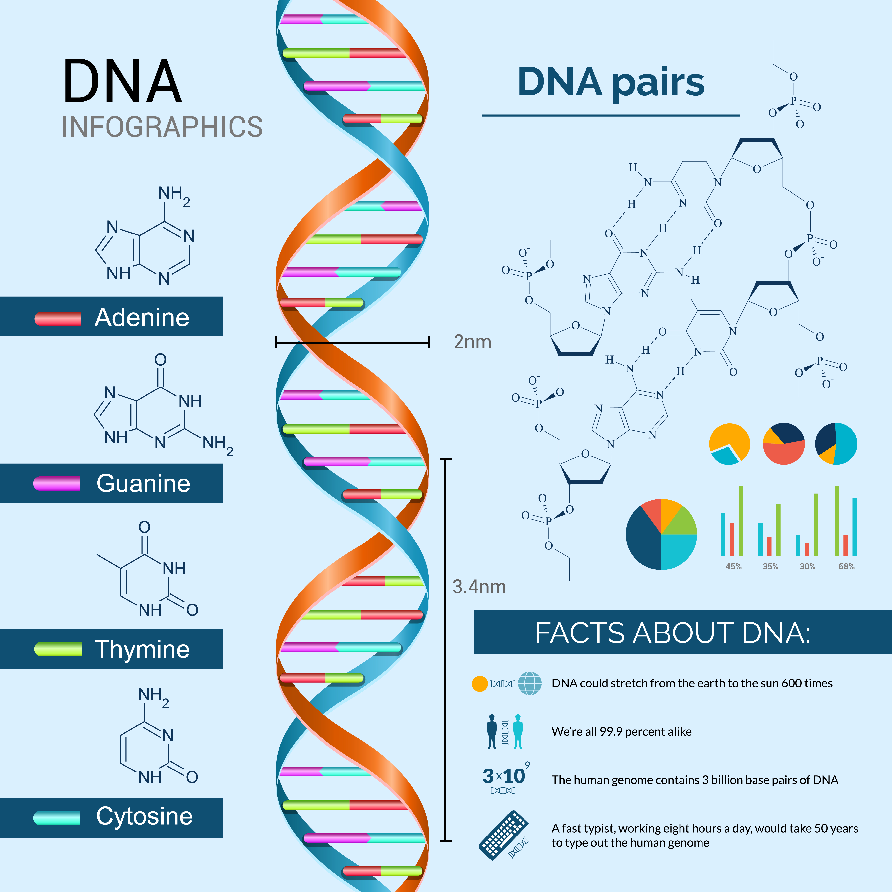

<h1>PYTHON №0. Задание по биоинформатике от нейросети (уровень junior).</h1>


* <a href="https://ru.freepik.com/free-vector/dna-concept-illustration_13717646.htm#page=2&query=%D0%B3%D0%B5%D0%BD%D0%B5%D1%82%D0%B8%D0%BA%D0%B0&position=22&from_view=keyword&track=sph">Изображение от storyset</a> на Freepik

Вечером в пятницу мне было немного скучно и я решил попросить у нейросети задание по
биоинформатике. Решил начать с простого и из-за этого указал уровень junior. Важно 
отметить, что биоинформатика - это достаточно широкая область и разумеется 
настоящие задачи биоинформатика (даже начинающего) в разы сложнее и требуют 
определённой квалификации. Однако после трудовых дней мне ничего не мешает 
немного помечтать.

<h3>0. Всё началось с формулировки.</h3>
Для меня было важно, что нейросеть поняла мой замысел. Я постарался явно указать уровень сложности, область и прочие вводные.


Звучит просто, но давайте начнём с базовых понятий, перед тем как переходить к реализации.

<h3>1. Основные понятия.</h3>


Живой организм - это живое существо, которое способно к самостоятельному функционированию и размножению. Он состоит из клеток.

Клетка - это наименьшая единица жизни, которая обладает всеми необходимыми компонентами для выполнения жизненных функций. Она состоит из мембраны, ядра, цитоплазмы и органелл.

Хромосомы - это структуры, содержащие генетическую информацию в виде длинных молекул ДНК. У человека обычно 46 хромосом, которые находятся в ядре клетки.

ДНК (дезоксирибонуклеиновая кислота) - это химическое вещество, которое содержит генетическую информацию, необходимую для развития и функционирования живых организмов. Она состоит из четырех видов нуклеотидов: аденин, тимин, гуанин и цитозин.

РНК (рибонуклеиновая кислота) - это молекула, которая играет важную роль в передаче и использовании генетической информации, содержащейся в ДНК. Она также состоит из нуклеотидов, но в отличие от ДНК, в РНК присутствует урацил вместо тимина.

Нуклеотиды - это основные строительные блоки ДНК и РНК. Они состоят из сахара (дезоксирибоза или рибоза), фосфата и одной из четырех азотистых оснований: аденина, тимина, гуанина или цитозина. Комбинации нуклеотидов образуют последовательность генетической информации в молекуле ДНК или РНК.


* <a href="https://ru.freepik.com/free-vector/dna-infographics-set_1536738.htm#query=%D1%81%D1%82%D1%80%D1%83%D0%BA%D1%82%D1%83%D1%80%D0%B0%20%D0%B4%D0%BD%D0%BA&position=0&from_view=search&track=ais">Изображение от macrovector</a> на Freepik

<h3>2. Реализация.</h3>
Давайте начнём реализацию с основного алгоритма. 
Поиск наибольшей цепочки, состоящей из одинаковых символов, 
достаточно простая задача - вот наш логический скелет:
```
def find_longest_sequence(dna_sequence):
    longest_sequence = ''
    current_sequence = ''

    for nucleotide in dna_sequence:
        if nucleotide in current_sequence:
            current_sequence += nucleotide
        else:
            if len(current_sequence) > len(longest_sequence):
                longest_sequence = current_sequence
            current_sequence = nucleotide

    return current_sequence if len(current_sequence) > len(longest_sequence) else longest_sequence
```
Есть несколько вещей, которые я бы хотел улучшить с точки зрения самого кода:
1. Записывать не саму последовательность, а символ и кол-во элементов в цепочке. В этом есть смысл, если говорить про очень большие последовательности.
2. Визуально сделать ветвление в теле цикла ровнее.
3. Добавить проверку нуклеотида. Мне представляется, что это можно сделать в цикле т.к. нам в любом случае надо проходить по каждому элементу.
4. Добавить типирование входных и выходных параметров функции. Формальность, но приятно.

Получается что-то такое:
```
def find_longest_sequence(dna_sequence: str) -> dict:
    longest = {'sequence': '', 'count': 0}
    current = {'sequence': '', 'count': 0}

    for nucleotide in dna_sequence:
        if check_nucleotide(nucleotide):
            raise ValueError(f'ERROR: Incorrect nucleotide: {nucleotide}')

        if nucleotide == current['sequence']:
            current['count'] += 1
        elif current['count'] > longest['count']:
            longest = current.copy()
            current['sequence'] = nucleotide
            current['count'] = 1
        else:
            current['sequence'] = nucleotide
            current['count'] = 1

    return current if current['count'] > longest['count'] else longest
```
1. С помощью словаря мы решили проблему записи цепочки. Теперь даже последовательность состоящая из 100 гуанинов будет иметь очень компактную запись `{'sequence': 'G', 'count': 100}`, вместо `GGGGGGGGGG...`
2. Пришлось формально дублировать обнуление текущей цепочки `current_sequence = nucleotide`, однако наше условие теперь не имеет вложенных условий, что значительно повышает прозрачность логики.
3. Проверку нуклеотида мы проводим сразу на каждой итерации цикла (исключение не обрабатываем, а просто выкидываем ошибку). Реализация самой функции `check_nucleotide` получилась такая:
```
def check_nucleotide(nucleotide: str) -> int:
    valid_nucleotides = {'A', 'T', 'G', 'C'}
    return 0 if nucleotide in valid_nucleotides else 1
```
4. По условию задачи на вход будет поступать строка. Возвращать же мы будем словарь.

Далее мне захотелось потестировать большие цепочки, но вбивать их руками не очень забавное занятие. 
Можно передавать имя файла! Можно было бы сделать контекстное меню, где у пользователя есть выбор, что именно он будет 
передавать: (1) имя файла или (2) саму последовательность. Но я решил немного упростить сам себе жизнь следующим образом:
```
def read_dna(file_path: str) -> str:
    try:
        with open(file_path, 'r') as dna:
            return dna.read()
    except FileNotFoundError:
        return file_path
        
DNA = read_dna(input("Последовательность ДНК или путь к файлу: "))
```
Да-да, я просто возвращаю input строку из функции read_dna, если не нахожу файл! Конечно же в реальности так никто не вздумает делать, 
но для домашних дел вполне интересный вариант, чтобы ускорить взаимодействие с программой.

Чтобы файл было удобно читать глазами, мне пришлось разбить последовательность переносами. 
Да, именно разбить, ведь теперь последовательность условно разделилась:
```
ATCGTCAAAAAATCGTCTCGATCGTCAATCGTCAATCGTCAATCGTCAATCGTCAATCGTCAATCG
TCAATCGTCAATCGTCAATCGTCAATCGTCAATCGTCAATCGTCAATCGTCAATCGTCAATCGTCA
ATCGTCAATCGTCAATCGTCAATCGTCAATCGTCAATCGTCAATCGTCAATCGTCAATCGTCAATC
GTCAATCGTCAATCGTCAATCGTCAATCGTCAATCGTCAATCGTCAATCGTCAATCGTCAATCGTC
AATCGTCAATCGTCAATCGTCAATCGTCAATCGTCAATCGTCAATCGTCAATCGTCAATCGTCAAT
CGTCAATCGTCAATCGTCAATCGTCAATCGTCAATCGTCAATCGTCAATCGTCAATCGTCAATCGT
CAATCGTCAATCGTCAATCGTCAATCGTCAATCGTCAATCGTCAATCGTCAATCGTCAATCGTCAA
TCGTCAATCGTCAATCGTCAATCGTCAATCGTCAATCGTCAATCGTCAATCGTCAATCGTCAATCG
TCAATCGTCAATCGTCAATCGTCAATCGTCAATCGTCAATCGTCAATCGTCAATCGTCAATCGTCA
ATCGTCAATCGTCAATCGTCAATCGTCAATCGTCAATCGTCAATCGTCAATCGTCAATCGTCAATC
GTCAATCGTCAATCGTCAATCGTCAATCGTCAATCGTCAATCGTCAATCGTCAATCGTCAATCGTC
AATCGTCAATCGTCAATCGTCAATCGTCAATCGTCAATCGTCAATCGTCAATCGTCAATCGTCAAT
CGTCAATCGTCAATCGTCAATCGTCAATCGTCAATCGTCAATCGTCAATCGTCAATCGTCAATCGT
CAATCGTCAATCGTCAATCGTCAATCGTCAATCGTCAATCGTCAATCGTCAATCGTCAATCGTCAA
TCGTCAATCGTCAATCGTCAATCGTCAATCGTCAATCGTCAATCGTCAATCGTCAATCGTCAATCG
TCAATCGTCAATCGTCAATCGTCAATCGTCAATCGTCAATCGTCAATCGTCAATCGTCAATCGTCA
ATCGTCAATCGTCAATCGTCAATCGTCAATCGTCAATCGTCAATCGTCAATCGTCAATCGTCAATC
GTCAATCGTCAATCGTCAATCGTCAATCGTCAATCGTCAATCGTCAATCGTCAATCGTCAATCGTC
AATCGTCAATCGTCAATCGTCAATCGTCAATCGTCAATCGTCAATCGTCAATCGTCAATCGTCAAT
CGTCAATCGTCAATCGTCAATCGTCAATCGTCAATCGTCAATCGTCAATCGTCAATCGTCAATCGT
CAATCGTCAATCGTCAATCGTCAATCGTCAATCGTCAATCGTCAATCGTCAATCGTCAATCGTCAA
TCGTCAATCGTCAATCGTCAATCGTCAATCGTCAATCGTCAATCGTCAATCGTCAATCGTCAATCG
TCAATCGTCAATCGTCAATCGTCAATCGTCAATCGTCAATCGTCAATCGTCAATCGTCAATCGTCA
ATCGTCAATCGTCAATCGTCAATCGTCAATCGTCAATCGTCAATCGTCAATCGTCAATCGTCAATC
```
Теперь, если собрать нашу программу и передать ей имя файла (внутри которого есть переносы строк), 
то мы получим ошибку, хотя все написанные нами элементы работают правильно.

Выходом из ситуации будет написание самого простого нормализатора. Я написал достаточно скучную, но отвечающую 
нашим запросам функцию:
```
def sequence_normalization(dna_sequence: str) -> str:
    return ''.join(nucleotide.upper() for nucleotide in dna_sequence if nucleotide not in {' ', '\n'})
```
Функция не должен быть встроена в наш основной алгоритм! Её использование обязано быть опциональным, ведь мы можем 
работать с уже нормализованной последовательностью и тогда мы не будем совершать лишних операций.
Пример использования:
```
DNA = read_dna(input("Последовательность ДНК или путь к файлу: "))
result = find_longest_sequence(sequence_normalization(DNA))
```
Собираем написанные элементы и не забываем про `if __name__ == '__main__'`:
```
def read_dna(file_path: str) -> str:
    try:
        with open(file_path, 'r') as dna:
            return dna.read()
    except FileNotFoundError:
        return file_path


def sequence_normalization(dna_sequence: str) -> str:
    return ''.join(nucleotide.upper() for nucleotide in dna_sequence if nucleotide not in {' ', '\n'})


def check_nucleotide(nucleotide: str) -> int:
    valid_nucleotides = {'A', 'T', 'G', 'C'}
    return 0 if nucleotide in valid_nucleotides else 1


def find_longest_sequence(dna_sequence: str) -> dict:
    longest = {'sequence': '', 'count': 0}
    current = {'sequence': '', 'count': 0}

    for nucleotide in dna_sequence:
        if check_nucleotide(nucleotide):
            raise ValueError(f'ERROR: Incorrect nucleotide: {nucleotide}')

        if nucleotide == current['sequence']:
            current['count'] += 1
        elif current['count'] > longest['count']:
            longest = current.copy()
            current['sequence'] = nucleotide
            current['count'] = 1
        else:
            current['sequence'] = nucleotide
            current['count'] = 1

    return current if current['count'] > longest['count'] else longest


if __name__ == '__main__':
    DNA = read_dna(input("Последовательность ДНК или путь к файлу: "))
    result = find_longest_sequence(sequence_normalization(DNA))

    print(f'Найденная цепочка: "{result["sequence"] * result["count"]}"\nДлина цепочки {result["count"]}')
```
<h3>Послесловие.</h3>
Задача получилась очень простая, а моя реализация не самая лучшая.
Я ещё не знаком с библиотекой Bio, может там уже есть специальная функция.
Возможно, в библиотеке есть специальный тип для последовательностей. Я лишь хотел
показать, что даже самые базовые знания Python могут помочь в автоматизации той или иной работы.